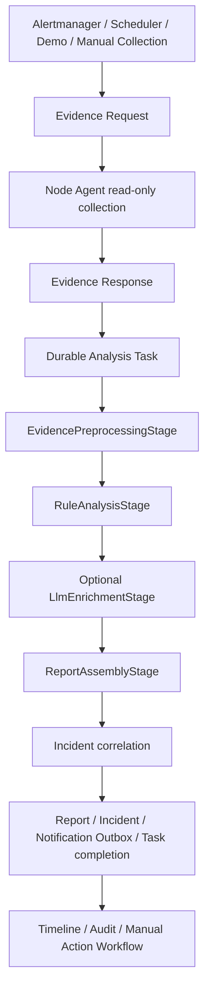

# Kubernetes Cluster Infra RCA Platform

Kubernetes 애플리케이션 로그가 아니라 **노드와 Linux 시스템 계층의 Evidence를 수집해 Rule-based RCA 보고서를 생성하는 플랫폼**입니다.

Node Agent가 노드 상태를 읽기 전용으로 수집하고, Spring Boot Platform이 증거 전처리, 규칙 분석, 선택적 LLM 설명, 정책 판단과 Incident correlation을 수행합니다. 운영 변경 명령은 Platform이나 Agent가 직접 실행하지 않습니다.

- 현재 구현 기준: [Current State](docs/current-state.md)
- 재현 가능한 시연: [Portfolio Demo](docs/portfolio-demo.md)
- 제출 전 확인: [Portfolio Release Checklist](docs/portfolio-release-checklist.md)
- 전체 문서: [Documentation Index](docs/README.md)

## Overview

장애의 첫 증상은 `NodeNotReady`, `DiskPressure`, Pod Pending, CoreDNS 지연처럼 보이지만 실제 원인은 디스크 I/O, inode 고갈, kubelet·runtime 장애, kernel error, NIC flap, MTU, conntrack 또는 systemd 문제일 수 있습니다.

이 프로젝트는 운영자가 노드에 접속해 확인하던 Linux/Kubernetes 증거 수집과 원인 후보 정리를 자동화합니다. 분석 결과에는 원인 후보, supporting evidence, 추가 확인 명령, 권장 조치와 정책 등급이 포함됩니다.

주요 진단 범위:

- `NodeNotReady`, `DiskPressure`, `MemoryPressure`, `PIDPressure`, `NetworkUnavailable`
- kubelet, containerd·CRI runtime, CNI, DNS·CoreDNS 장애
- API Server와 etcd 지연
- 디스크 용량·inode·I/O latency, kernel I/O error
- systemd unit 실패와 restart loop
- NIC link flap, MTU 불일치, conntrack 고갈

Pod 상태, HTTP 5xx, Service endpoint와 Ingress 오류는 원인 단서와 영향 범위를 보완하는 Evidence로만 사용합니다.

## Problem

Kubernetes self-healing은 Pod 재시작이나 재스케줄링에는 강하지만, 노드와 Linux 계층의 근본 원인을 설명하지 않습니다. 일반적인 Pod 모니터링만으로는 다음 질문에 답하기 어렵습니다.

- kubelet이 느린 이유가 디스크 I/O인지 runtime hang인지
- DNS 실패가 CoreDNS 자체 문제인지 노드 resolver나 CNI MTU 문제인지
- NodeNotReady 이전에 kernel, systemd, NIC에서 어떤 신호가 먼저 발생했는지
- 같은 Evidence가 하나의 Incident로 이어졌는지
- 운영자가 어떤 확인을 안전하게 수행해야 하는지

Platform은 결정론적 규칙을 분석 기준으로 사용하고 LLM은 설명을 보강하는 역할로 제한합니다.

## Core Workflow



`RcaAnalysisWorker`는 DB 기반 Analysis Task를 claim하고 worker lease, heartbeat renewal, Java virtual thread, 지수형 retry, `retry_wait`, `dead_letter`를 관리합니다. Kafka나 외부 메시지 브로커를 사용하는 구조는 아닙니다.

## Architecture

| Component | Stack | 실제 책임 |
| --- | --- | --- |
| Platform | Spring Boot `3.5.16`, Java `21`, Spring AI `1.1.8`, Google GenAI SDK `1.64.0` | API, 인증, durable task, RCA, Policy, Incident, Audit, Outbox |
| Web Console | React `19.2.7`, React Router `8.3.0`, TypeScript `6.0.3`, Vite `8.2.0`, Bootstrap `5.3.8` | 운영 화면과 승인·수동 처리 workflow |
| Node Agent | Python `3.10+` 지원, container·CI 기준 `3.12`, Agent protocol `v2` | 노드 Evidence 수집, redaction, spool, token rotation, 선택적 eBPF event |
| Database | PostgreSQL `16`, MariaDB `11.x`, local H2 | 운영 상태와 보고서 저장 |
| Migration | Flyway V26, 26 migrations | 신규·기존 schema 관리 |
| Packaging | 단일 Spring Boot 애플리케이션 | React 정적 자산과 API를 함께 제공 |

Web Console은 React SPA 한 종류만 사용하며 JSP나 별도 Python Backend는 없습니다.

### RCA pipeline

`RuleBasedRcaAnalyzer`는 다음 단계를 연결하는 작은 오케스트레이터입니다.

1. `EvidencePreprocessingStage`: Evidence 정규화, 신호 탐지, 품질 평가, 민감정보 정제
2. `RuleAnalysisStage`: 규칙 기반 후보, Evidence, 추가 확인과 권장 조치 생성
3. `LlmEnrichmentStage`: 설정된 경우 설명과 낮은 우선순위 후보 보강
4. `ReportAssemblyStage`: 보고서, 품질 정보와 정책 결과 조립

### Node Agent

Collector registry에는 14개 Collector가 있습니다.

```text
node, kubernetes, systemd, kernel, disk, inode, memory, process,
network, conntrack, runtime, kubelet, cni, dns
```

| Mode | 범위 |
| --- | --- |
| `safe` | `node`, `kubernetes`, `dns`; 비-root, hostPath 없음 |
| `node-diagnostics` | 14개 Collector 전체; 필요한 host 자원을 읽기 전용 mount |
| `ebpf` | `node-diagnostics`와 같은 Collector + `EBPF_ENABLED`일 때 realtime event |

eBPF는 15번째 일반 Collector가 아니라 별도의 realtime Evidence 경로입니다. Agent는 등록, heartbeat, Evidence Request polling, Collector 실행, 응답 제출, local spool 재전송과 node token rotation을 수행합니다.

### Web Console

구현된 화면은 `Overview`, `Clusters`, `RCA Reports`, `Incidents`, `Pipeline`, `Audit`, `Webhooks`, `Settings`입니다. Report 상세에서는 다음 정보를 확인할 수 있습니다.

- Confidence, Rule signals, Quality gate, Evidence quality, Policy blocked 수, LLM 상태
- Bundle verification, Cascading timeline, Rule evidence, LLM usage
- Root cause candidates, Evidence summary, Additional checks
- Policy gate, Recommended actions, Action requests, 수동 처리 완료 이력

## What Is Actually Implemented

- 클러스터 등록·삭제와 Agent 설치 명령 생성
- bootstrap token 또는 Kubernetes TokenReview 기반 Agent 등록
- session 인증, RBAC, Audit 검색·필터·export
- DB 기반 durable Analysis Task와 fenced lease
- Rule-based RCA, 선택적 LLM 보강, Incident correlation
- 장애 전파 timeline과 영향 범위 표시
- Transactional Outbox 기반 Slack·webhook 알림
- 읽기 전용 Evidence 재수집과 approval/manual workflow
- 승인된 Catalog override의 GitOps PR 생성 및 외부 배포 결과 추적
- PostgreSQL·MariaDB 호환 migration과 backup·restore 검증
- 외부 Kubernetes reviewer credential의 상태 확인과 bounded rotation
- Docker Compose, Platform·Agent Helm chart, Prometheus·Alertmanager 연동
- 한국어·영어 locale 저장과 반응형 운영 Console

GitOps 자동화의 직접 대상은 `catalog_override_draft`입니다. 일반 RCA 조치가 자동으로 Kubernetes manifest PR로 변환되거나 배포되는 기능은 없습니다.

## Safety Boundary

| Policy | 의미 | Platform 동작 |
| --- | --- | --- |
| `AUTO_SAFE` | 추가 읽기 전용 확인 | Evidence Request 생성 가능 |
| `APPROVAL_REQUIRED` | 사람이 검토해야 하는 변경 | 승인·거절 기록, Runbook 안내, 수동 완료 기록 |
| `GITOPS_PR_ONLY` | 외부 변경 검토 필요 | 지원되는 Catalog override만 GitOps PR 추적 |
| `NEVER_AUTO_EXECUTE` | 자동 실행 금지 | 실행 경로 없음 |

- Rule-based 결과가 분석 기준입니다.
- LLM은 선택적인 설명 보강이며 LLM-origin action은 `automation_allowed=false`, `executable=false`입니다.
- Platform과 Agent는 reboot, restart, drain, delete, sysctl 변경 같은 운영 명령을 직접 실행하지 않습니다.
- `POST /api/agents/action-executions`는 빈 목록을 반환합니다.
- `POST /api/agents/action-results`는 의도적으로 `410 Gone`을 반환합니다.
- 변경 작업은 승인, 수동 Runbook 또는 외부 GitOps 절차로 처리합니다.

## Demo

기본 포트폴리오 Scenario는 `cni-mtu-mismatch`입니다. CNI와 network Evidence를 함께 사용해 `NetworkUnavailable` 계열 원인 후보, 장애 전파 timeline과 정책 경계를 보여줍니다.

두 가지 시연 경로를 제공합니다.

1. **Track A - 내장 Demo:** 합성 Evidence를 사용해 누구나 동일한 RCA workflow를 재현합니다.
2. **Track B - 실제 RKE2 Agent:** 실제 노드에서 Agent 연결, 수동 수집, 보고서와 Audit을 확인합니다.

내장 Demo는 실제 RKE2 장애 수집 결과가 아닙니다. 단계별 진행과 필수 Screenshot은 [Portfolio Demo](docs/portfolio-demo.md)에 정리했습니다.

## Validation Status

검증 수준을 실제 Agent, Kind/CI, contract fixture로 구분합니다.

| 환경 | 검증 수준 | 상태 |
| --- | --- | --- |
| RKE2 amd64/arm64 | Real Agent E2E | 완료 기록 존재 |
| K3s amd64 | Real Agent E2E | 완료 기록 존재 |
| kubeadm Ubuntu 24.04 amd64 | Real Agent E2E | 완료 기록 존재 |
| Kind 3-node | Standard 1시간 / Extended 5시간 Fleet | 완료 기록 존재 |
| Kind 3-node 현재 코드 smoke | Kind v0.31.0 / Kubernetes v1.35.0 | **통과 - bootstrap·TokenReview Agent 각각 3/3 등록** |
| EKS | 공식 문서 기반 contract fixture | 실제 Canary 미완료 |
| AKS | 공식 문서 기반 contract fixture | 실제 Canary 미완료 |
| GKE | 공식 문서 기반 contract fixture | 실제 Canary 미완료 |
| OpenShift | 공식 문서 기반 contract fixture | 실제 Canary 미완료 |

Extended Fleet run `29857828475`는 checkpoint `300/300`, Platform Evidence `900/900`, target `3/3`, 수집 성공률과 Evidence 품질 `100%`, degraded와 runtime/spool/quarantine 오류 `0`을 기록했습니다. 이 수치는 해당 Kind burn-in 결과이며 실제 운영 정확도를 뜻하지 않습니다.

2026-08-02 격리 Linux 환경 smoke는 3개 target, 수집 성공률과 Evidence 품질 `100%`, degraded collector `0%`, 수집 p95 `14.955초`, runtime/spool/quarantine 오류 `0`을 기록했습니다. 위험 profile 차단과 migration, 전용 audience의 Kubernetes API 접근 거부, TokenReview 인증 및 전체 Agent 등록도 통과했습니다.

2026-08-05 기준 `main` 커밋 `17c4807e`의 CI run `30963465762`는 Java·Frontend·Agent·DB·Helm·Kind·Prometheus Operator 전달·Docker build gate를 모두 통과했습니다. 같은 커밋의 Security run `30963465765`도 secret, SBOM, filesystem/image scan과 Java·Python CodeQL을 통과했습니다. Edge image 게시 run `30963845100`과 Demo 배포 run `30963845114`도 성공했습니다.

## Quick Start

### Docker Compose

```bash
cp .env.example .env
```

PowerShell:

```powershell
Copy-Item .env.example .env
```

`.env`에 최소 설정을 입력합니다.

```dotenv
RCA_DEFAULT_ADMIN_USERNAME=admin
RCA_DEFAULT_ADMIN_PASSWORD=<strong-password>
RCA_WEBHOOK_TOKEN=<random-webhook-token>
RCA_DEMO_ENABLED=true
```

```bash
docker compose up --build -d
docker compose ps
```

```text
Web Console / API  http://localhost:8080
Readiness          http://localhost:8080/health/ready
```

첫 로그인 후 `Pipeline`에서 `cni-mtu-mismatch`를 실행합니다. 초기 계정은 코드에 고정되어 있지 않으며 환경 변수나 외부 Secret으로 생성합니다.

### Java local

Java 21과 Maven 3.9 이상이 필요합니다. 별도 DB 설정이 없으면 local H2를 사용합니다.

```bash
export RCA_DEFAULT_ADMIN_USERNAME=admin
export RCA_DEFAULT_ADMIN_PASSWORD='<strong-password>'
export RCA_WEBHOOK_TOKEN='<random-webhook-token>'
export RCA_DEMO_ENABLED=true
mvn -f web-console/pom.xml -Pfrontend process-resources spring-boot:run
```

### Node Agent

Web Console에서 클러스터를 등록한 뒤 생성된 설치 명령을 사용하는 것이 기본 경로입니다. 수동 Helm 예시는 다음과 같습니다.

```bash
helm upgrade --install rca-agent charts/cluster-infra-rca-agent \
  --namespace rca-system \
  --create-namespace \
  --set backendUrl=https://rca.example.com \
  --set mode=node-diagnostics \
  --set secret.existingSecret.name=agent-auth
```

운영 환경에서는 실제 registry image와 외부 Secret을 사용합니다. TokenReview 등록, 권한과 canary 절차는 [Agent Enrollment](docs/agent-enrollment.md)과 [Agent Helm Chart](docs/helm-agent-chart.md)를 확인합니다.

### Common options

| 목적 | 환경 변수 |
| --- | --- |
| PostgreSQL | `RCA_JDBC_URL=jdbc:postgresql://host:5432/rca` |
| MariaDB | `RCA_JDBC_URL=jdbc:mariadb://host:3306/rca` |
| 내장 Demo | `RCA_DEMO_ENABLED=true` |
| 자체 수집 Scheduler | `RCA_MONITORING_ENABLED=true` |
| Prometheus metrics | `RCA_OBSERVABILITY_ENABLED=true` |
| Slack·webhook | `RCA_NOTIFICATION_ENABLED=true` |
| Catalog GitOps | `RCA_GITOPS_ENABLED=true` |
| LLM 보강 | `RCA_LLM_ENABLED=true` |

LLM provider는 OpenAI, Anthropic, Gemini, Ollama, OpenAI-compatible, self-hosted endpoint를 지원합니다. Provider 설정이 없어도 Rule-based RCA는 동작합니다. 자세한 설정은 [LLM Analyzer](docs/llm-analyzer.md)를 참고합니다.

### Validation commands

```bash
python3 scripts/verify-documentation.py
python3 scripts/release-readiness-check.py
python3 scripts/verify-api-contract.py
python3 scripts/verify-container-pinning.py
python3 scripts/verify-operational-catalog.py
python3 scripts/verify-supply-chain-workflows.py
python -m pytest -q
mvn -f web-console/pom.xml verify
cd web-console/frontend && npm ci --no-audit --no-fund && npm test && npm run build && npm run smoke:routes
```

`npm run smoke:routes`는 기본적으로 `http://127.0.0.1:8080`에서 실행 중인 통합 애플리케이션을 검사합니다. DB, Playwright, Helm과 실환경 검증 명령은 [Testing](docs/testing.md)과 [Portfolio Release Checklist](docs/portfolio-release-checklist.md)를 확인합니다.

## Known Limitations

1. EKS, AKS, GKE, OpenShift는 contract fixture까지만 검증됐고 실제 managed canary가 남아 있습니다.
2. RCA 품질 지표는 golden, production-like, 내부 holdout corpus의 회귀 결과이며 실운영 정확도가 아닙니다.
3. 24시간 Production Fleet와 충분한 LLM 실표본 검증은 완료되지 않았습니다.
4. 실제 RKE2 시연 Screenshot과 민감정보 검토는 저장소 소유자가 최종 제출 전에 추가해야 합니다.

## AI-Assisted Development Disclosure

요구사항과 제품 경계, Kubernetes/Linux 장애 분석 방향, 안전 정책과 실제 인프라 검증 기준은 프로젝트 소유자가 정의했습니다.

코드 생성, 반복 구현, 테스트 보강, 리팩터링과 문서화 일부에는 생성형 AI와 Codex를 활용했습니다. 생성된 결과는 테스트, 실제 클러스터 검증, 코드 리뷰와 운영 안전 경계 확인을 통해 검토했습니다.

## Documentation

| 문서 | 목적 |
| --- | --- |
| [Current State](docs/current-state.md) | 현재 stack, 구현 범위와 검증 기준 |
| [Portfolio Demo](docs/portfolio-demo.md) | 내장 Demo와 실제 RKE2 시연 절차 |
| [Portfolio Release Checklist](docs/portfolio-release-checklist.md) | 제출 전 검증과 동결 판단 |
| [Architecture](docs/architecture.md) | 전체 컴포넌트와 데이터 흐름 |
| [Security](docs/security.md) | 인증, Secret과 production guardrail |
| [Testing](docs/testing.md) | 로컬·CI·실환경 검증 명령 |
| [Roadmap](docs/roadmap.md) | 완료 범위와 Post-Portfolio Backlog |

저장소 구조와 전체 문서 목록은 [Documentation Index](docs/README.md)에서 확인할 수 있습니다.
