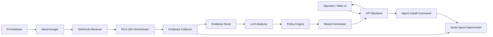

# 아키텍처

이 플랫폼은 Kubernetes 장애 이벤트를 트리거로 사용하지만, 분석의 중심은 클러스터 노드와 Linux 시스템 계층입니다.

## 논리 구조

## 장애 분석 흐름

1. Alertmanager가 `NodeNotReady`, `DiskPressure`, kubelet 장애, CNI 장애 같은 이벤트를 Backend webhook으로 전송합니다.
2. Webhook Receiver는 alert label에서 클러스터, 노드, namespace, component, severity, 시간 범위를 추출합니다.
3. RCA Job Orchestrator는 장애 유형별 evidence profile을 선택합니다.
4. Evidence Collector는 관련 Node Agent에 증거 수집을 요청합니다.
5. Node Agent는 노드 로컬 로그와 시스템 상태를 수집해 evidence bundle을 반환합니다.
6. LLM Analyzer는 증거 bundle을 읽고 진단 보고서 초안을 생성합니다.
7. Policy Engine은 보고서의 권장 조치를 안전 등급으로 분류합니다.
8. Report Generator는 운영자가 읽을 수 있는 최종 RCA 보고서를 생성합니다.

## 신뢰 경계

LLM Analyzer는 실행 권한을 갖지 않습니다.

- 노드 접속 권한 없음
- Kubernetes write 권한 없음
- systemd 제어 권한 없음
- 재시작, 삭제, 수정, 스케일 조정 권한 없음

LLM이 생성한 권장 조치는 Policy Engine의 입력일 뿐이며, Policy Engine과 운영 승인 흐름을 통과해야만 실행 후보가 됩니다.

## 데이터 흐름

- Alert event: Prometheus/Alertmanager에서 Backend로 전달되는 장애 트리거
- Evidence request: Backend에서 Node Agent로 전달되는 수집 요청
- Evidence bundle: Node Agent가 반환하는 로그, 메트릭, 상태 정보 묶음
- RCA analysis: LLM이 생성하는 원인 후보와 근거
- Policy decision: 조치 권한과 실행 가능성에 대한 분류
- RCA report: 운영자에게 제공되는 최종 보고서

